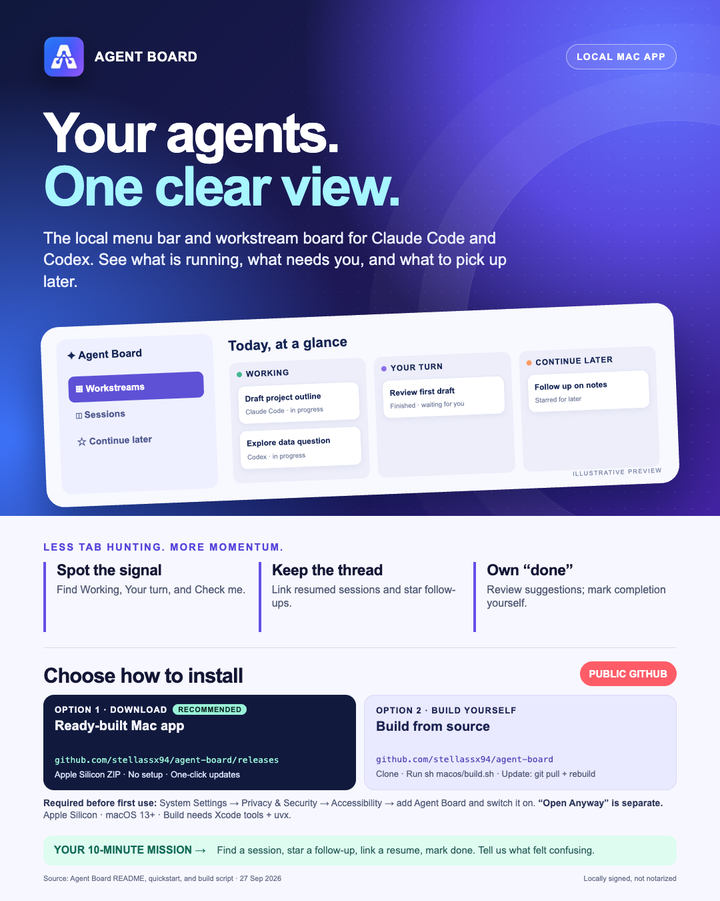
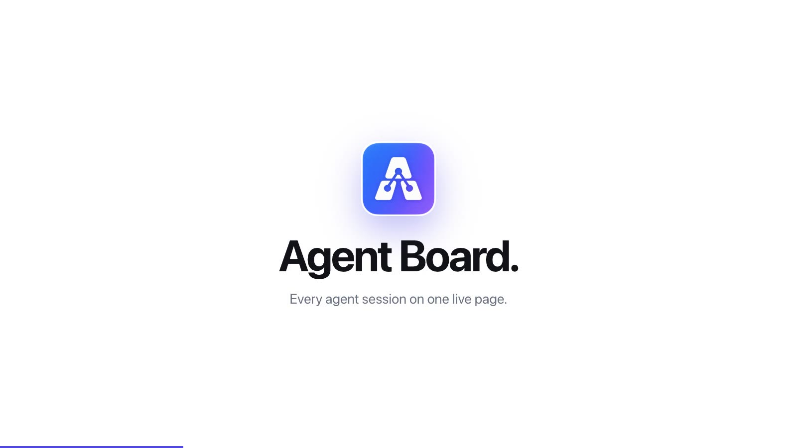

# Agent Board

Agent Board is a local Mac app with a built-in menu bar view and board window for Claude Code and Codex sessions. Its Python service reads session files on your Mac and serves the board at `http://127.0.0.1:8765/`. SwiftBar is not needed.

> [!IMPORTANT]
> **Required for the Mac app:** After putting `Agent Board.app` in its final location, open **System Settings → Privacy & Security → Accessibility**. Add `Agent Board.app` with the **+** button if it is not listed and switch it on. Then open Agent Board; if it is already running, quit and reopen it. If you move or replace the app later, macOS may ask you to grant access again.

Click the poster for a [PDF version](AgentBoard-poster.pdf) with working links.

## Watch the demo

Click the image to play the 90-second tour. For a player with chapters, open [`docs/colleague-intro/demo.html`](docs/colleague-intro/demo.html) from a clone or from the colleague-intro ZIP. The demo uses made-up tasks.

## Run locally

1. Clone this repository to a folder on your Mac.
2. Run `python3 agent_board.py` from the repository. Use `--no-open` to start it without opening a browser.
3. Open `http://127.0.0.1:8765/` if the browser did not open automatically.

The default sources are `~/.claude/projects` and `~/.codex/sessions`. Missing sources are skipped. A running board updates every five seconds. Stop it with Ctrl+C. If another Agent Board already uses port 8765, start this copy with `python3 agent_board.py --port 8766` and open the matching URL.

## Personal settings

Settings, board choices, and confirmed workstream links live in `~/.agent-board/`, outside the clone. Create that folder and copy `examples/config.example.json` to `~/.agent-board/config.json` to change sources or opening behavior. You may also copy `examples/custom.example.css` to `~/.agent-board/custom.css` to change colors, spacing, and layout. The custom CSS loads after the built-in styles, so your design survives source updates.

To group work by topic, copy `examples/topics.example.json` to `~/.agent-board/agent_board_topics.json`. Each topic has a label and keywords; a row joins the topic whose keywords match whole words in its title most often, and the first topic wins a tie. A topic with no keywords uses its own label. `folders` files a row by its working folder when no keyword matches. The board shows the topic on each row and adds a topic filter; the VS Code sidebar can group by it. The file is read again whenever it changes.

The supported config fields are:

| Field | Purpose |
| --- | --- |
| `claude_roots` | List of Claude Code `projects` directories. Add another account's projects directory here if you use one. |
| `codex_dir` | Codex data directory containing `sessions` and `session_index.jsonl`. |
| `open_targets` | `folder` (default) or `vscode`, separately for `claude` and `codex`. `folder` opens the session's project folder. Sessions created in the Claude or Codex Mac apps open in their respective apps when the session origin can be identified. |
| `vscode_cli` | Optional path to the VS Code `code` executable if it is not on your PATH. |
| `vscode_user_data_dirs` | Optional mapping from a Claude root name to a VS Code user data directory for a second VS Code profile. |

For example, a second Claude account can be configured by adding `"~/.claude-work/projects"` to `claude_roots`. To retain VS Code session opening, set both `open_targets` values to `"vscode"`. VS Code deep links require the corresponding extensions; if unavailable, use `folder`. On macOS, the board first brings forward or opens the VS Code window for the session's folder and then sends the session link, because the Claude Code extension loads a session only from a window open on that folder. Claude Code sessions created in the Claude Mac app use its local session metadata to reopen the matching app session. Codex Desktop sessions use their recorded originator and thread ID. Cursor session opening is not verified yet.

Set `AGENT_BOARD_DATA_DIR` to relocate all personal state and CSS, or `AGENT_BOARD_CONFIG` to use a specific config file. The board offers both a Workstreams view and a Sessions view. You can manually link sessions, confirm suggested links, and mark a whole workstream done. Suggested links are only proposals until you confirm them. The optional `agent_board_classify.py` Stop hook records completion suggestions. A short explicit user closeout such as `done`, `ok done`, or `mark this session done` writes the same reversible completion marker as the board button. Saying `continue later` marks the current session done and stars its workstream for the Continue later list. Questions, negations, and longer follow-up requests remain unconfirmed. Removing the star moves a parked session to Completed; later activity reopens its completion marker. The board also recovers some missed suggestions when it reads a recently finished turn. The optional `agent_board_workstreams.py capture-stop` hook records a resume link when a supported resume marker appears in an actual tool command. The optional `agent_board_workstreams.py capture-tool` hook, added as a Claude Code `PostToolUse` hook with the matcher `Bash`, records the same link as soon as the marker command runs, so a resumed chat joins its workstream while it is still working. Give these hooks the same `AGENT_BOARD_DATA_DIR`; no hook is required to view sessions. When Claude Code is installed and any of these hooks is absent, the board shows a one-time **Finish setup for Claude Code** box. **Add hooks**, after a second confirming click, saves a copy of your Claude Code `settings.json` in the `backups` folder of the Agent Board data folder, then adds the hooks there and replaces older Agent Board hook entries. It changes no other setting. **Not now** hides the box. The board never edits `settings.json` unless you choose **Add hooks**. Claude Code does not write its permission prompts to the chat log. To show a Claude chat under **Asking you** while it waits for you to allow a tool, add a Claude Code `Notification` hook with the matcher `permission_prompt` that runs `/usr/bin/python3 -B "$HOME/Applications/Agent Board.app/Contents/Resources/Backend/agent_board_classify.py" capture-prompt`. The hook writes `agent_board_prompts.json`. The board clears the state when the chat logs new activity or the approved command starts. Without this hook, a Claude chat that waits for approval stays in **Working**. Codex approval detection does not use it. **Resume in new chat ↻** starts a fresh chat in the app the session came from (Claude app, Claude Code in VS Code, Codex app, or Terminal) and fills in a prompt that asks the resume skill to read that session's `~/.agent-handoffs/` snapshot. The prompt starts with `Continue:` and the session's title, so the new chat gets a readable name. The Codex VS Code extension has no link that fills a chat, so there the prompt is copied to the clipboard for you to paste. Most apps wait for you to press Enter. The optional SwiftBar plugin is in `optional/agent_board.5s.py`.

Stars are saved in `agent_board_flags.json` in the personal data directory. A workstream keeps its star when a linked session continues it; removing the star from the workstream clears stars on its linked sessions. A new session must be linked to the earlier workstream before its card can inherit that star. When the newest linked session has just finished, the card shows Your turn first and returns to Continue later once that session is idle; a session starred directly stays in Continue later.

## VS Code sidebar

`vscode-extension/` contains Agent Board Sidebar, a compact session list for VS Code with open, resume, done, and Continue later actions. Run `sh vscode-extension/package.sh`, then `code --install-extension build/agent-board-sidebar-<version>.vsix`, or install the `.vsix` attached to a release. See [its readme](vscode-extension/readme.md).

## Updating and contributing

Run a local Git checkout as the board service's code source. Keep personal settings and marked tasks in `~/.agent-board/`. The board header shows the running service version from `VERSION`. The native menu shows both the installed app and running service versions and marks a mismatch. In v0.4.9 and later, **Check for updates…** checks the public GitHub release only when selected, shows the version, then offers a separate download/install action and final relaunch confirmation; the board-window **Releases** link still opens the release page. v0.4.8 and earlier require one manual install to get this updater. The updater replaces the app bundle only, not separately installed optional hooks. See [the trust model](docs/SECURITY_NOTES.md). Each release updates `VERSION` and has a matching Git tag. To update a source checkout, quit Agent Board, run `git pull --ff-only` and `sh macos/build.sh`, then open the rebuilt app. If you copied the app into Applications, replace that copy with the rebuilt app while it is closed. A pull alone does not reload a running Python service or rebuild the Mac app. To roll back, check out the previous release tag and rebuild. Review each release before activating it.

To check and prepare a local release package, run `python3 macos/prepare_release.py`. It runs tests, syntax and privacy checks, a clean-profile check, then builds and verifies an Apple Silicon app ZIP under ignored `build/`. Use `--check-only` to skip the build. This command does not install the app, push Git, or create a release; a separate reviewed publication step is still required.

Colleagues can send changes through pull requests or fork the repository for deeper changes. The browser dashboard and Python service are currently in one script; splitting them into modules is a later maintainability task, not a setup requirement.

This repository contains source and examples only. Do not commit local session logs, exported board status, `~/.agent-board/` state, credentials, or chat content. The default page makes no external font request. Custom CSS is user controlled, so avoid remote `@import` rules if you want the page to stay fully local.

## Mac app

For an Apple Silicon Mac running macOS 13 or later, we recommend the [ready-built v0.4.14 app](https://github.com/stellassx94/agent-board/releases/tag/v0.4.14): it needs no setup and updates from inside the app with **Check for updates…**. A local source build is also possible, but you update it yourself with `git pull --ff-only` and `sh macos/build.sh`. The ready-built ZIP is attached to the public GitHub release and does not require VPN, Xcode Command Line Tools, `uvx`, Python, or SwiftBar. Its SHA-256 is `c12cafb3ee5d59493bb52173aca81cf0689973d3154fce8080bde7545d091d72`. Unzip it and put `Agent Board.app` in the location where you plan to keep it. Then grant it the required **Accessibility** access using the steps at the top of this README and reopen the app.

Accessibility access and Gatekeeper approval are separate. Because the app is locally signed but not Apple-notarized, macOS may also block the first launch. If that happens, verify that you downloaded it from the official release, then use **System Settings → Privacy & Security → Open Anyway**. Do not change either setting if your company policy blocks it.

To build it yourself on macOS with Xcode Command Line Tools and `uvx`, run `sh macos/build.sh`, then open `build/Agent Board.app`. The default build uses pinned PyInstaller to bundle the Python service and runtime. The app starts its service when needed and shows workstream counts in its own menu bar item. The board window has a compact workspace view: empty sections collapse, empty attention subgroups are hidden, and the sidebar starts collapsed. In the Mac app window, **Check for updates...** uses the same native update check as the menu bar; the browser board instead links to releases. The menu bar uses amber `?` for Asking you, red `!` for Check me, blue `↩` for Your turn, green `✦` for Working, and `📌` for Continue later; zero counts stay hidden. Working and the highest-priority attention symbol pulse gently unless Reduce Motion is enabled. Closing the board window keeps the menu running; Quit Agent Board stops a service started by the app. Use the native menu’s Launch at Login toggle to keep it available after sign-in. Set `AGENT_BOARD_BUNDLE_RUNTIME=0` only for a development build that uses an installed Python 3. The build targets the current Mac architecture and is signed locally, but it is not notarized. Set `AGENT_BOARD_APP_PATH` to build elsewhere.

See [Security notes](docs/SECURITY_NOTES.md) for the deferred local API key decision.

## Colleague pilot intro

Share the [one-page poster](docs/colleague-intro/poster.png) (or its [PDF version with working links](AgentBoard-poster.pdf)) with colleagues who want to try Agent Board. The [quickstart](docs/colleague-intro/QUICKSTART.md) covers prerequisites, installation, first actions, and troubleshooting. A [ready-to-forward message](docs/colleague-intro/SHARE_MESSAGE.txt) and a [ZIP pack](docs/colleague-intro.zip) are also available. The project and release download are public on GitHub; no repository invitation or corporate VPN is required.
